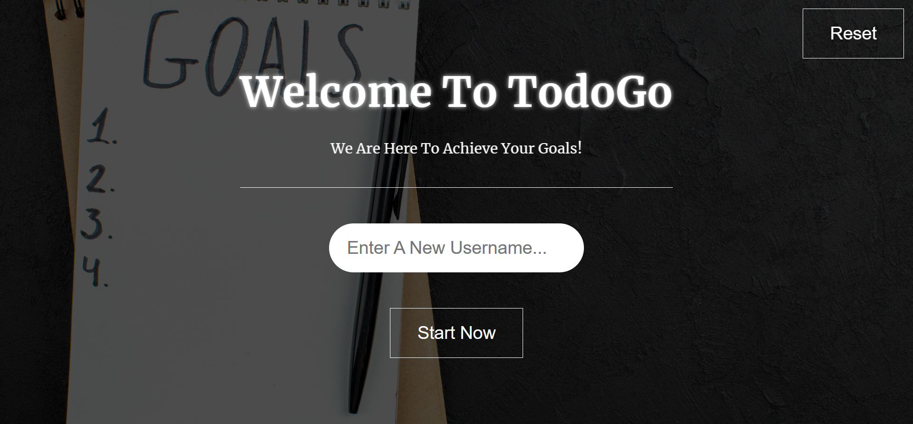
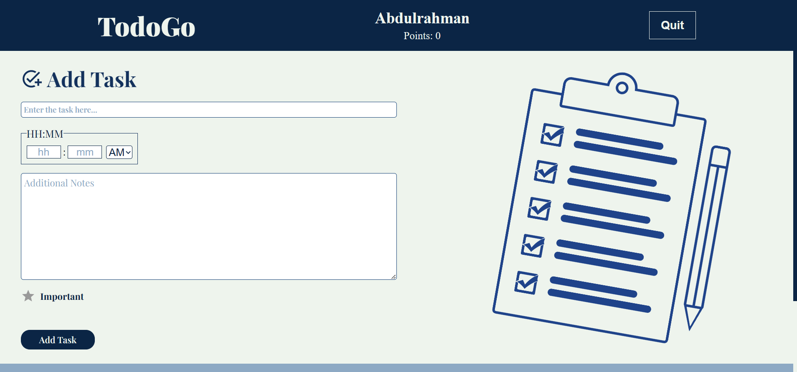
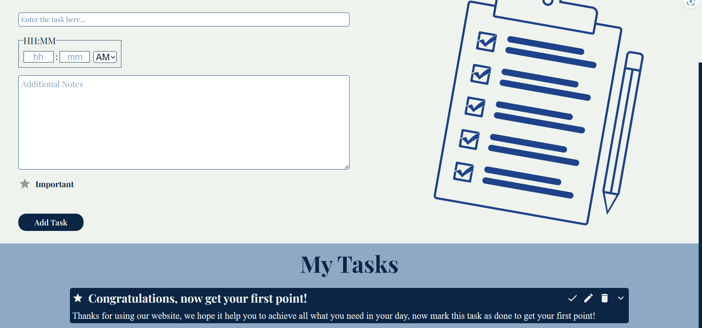

# TODO-List APP | TodoGo

- This web application, developed with React, offers an intuitive and responsive user interface.
- With this powerful todo-list app, you can create, edit, and remove tasks effortlessly, And the app also includes error handling to enhance its usability.
- Plus, to ensure your tasks are always saved, the app utilizes a smart data storage system that securely stores your data locally, allowing you to access your tasks across multiple sessions.

## Tools & Technologies

- React
- React Router
- JavaScript
- Sass (CSS)

## Features

- This todo-list app, built with React, offers the following features:
  - Add, edit, and remove tasks with ease
  - Earn points for each completed task, motivating you to stay productive
  - Utilize a user-friendly interface for managing your tasks efficiently

## Screenshots

---

## 🚀 About Me

Junior Front-end developer with a history of creating engaging, user-friendly websites with proven success. Developed modern websites with advanced features, showcasing technical excellence. Motivated to stay up-to-date with industry trends and best practices. Aspiring to be a Full-stack developer with a strong determination and passion for coding.

## 🛠 Skills

- HTML/HTML5
- CSS/CSS3
- JavaScript
- Object Oriented Programming (OOP)
- Sass\SCSS
- Pug
- GulpJs
- BootStrap
- Material UI
- React.js
- React ecosystems (React Router - React Redux - React Query)
- Redux - Redux Toolkit
- Firebase

## 🔗 Links

